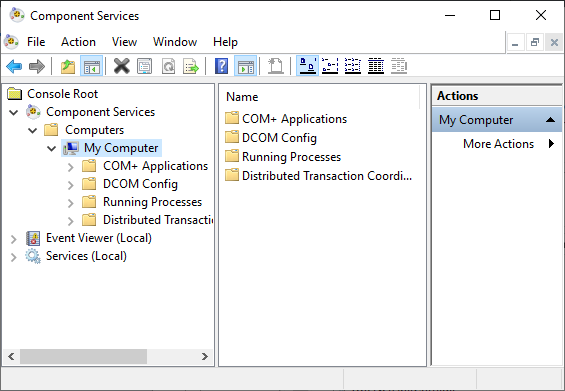
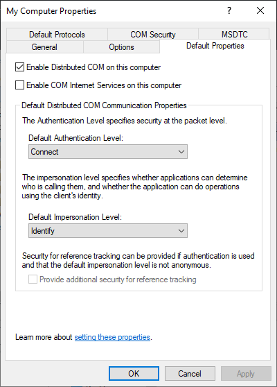
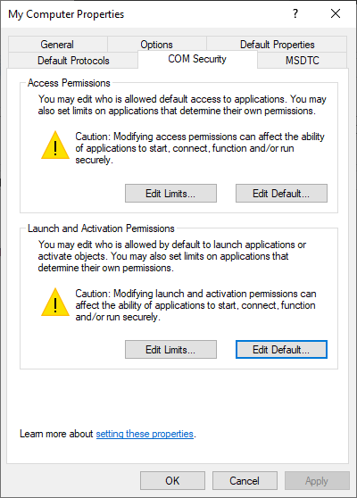
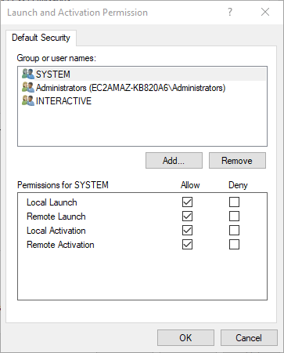
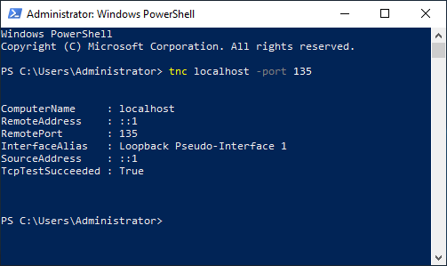
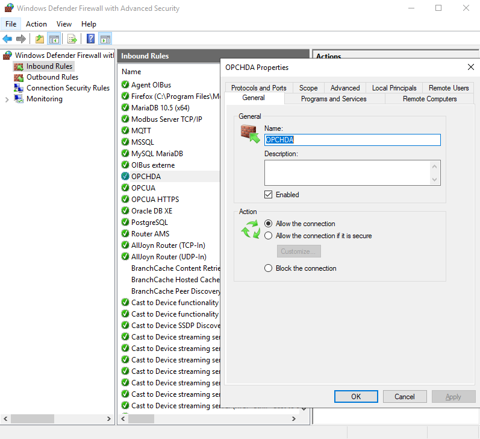
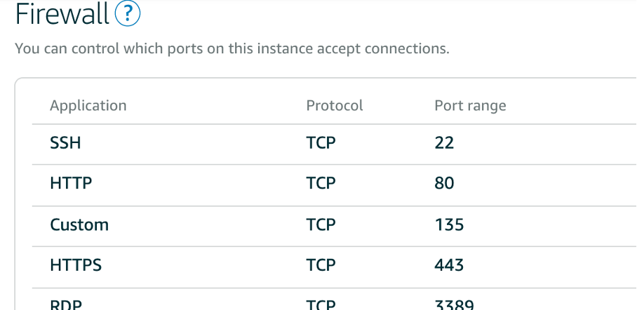
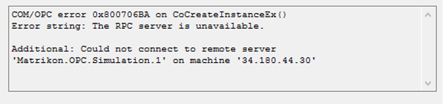
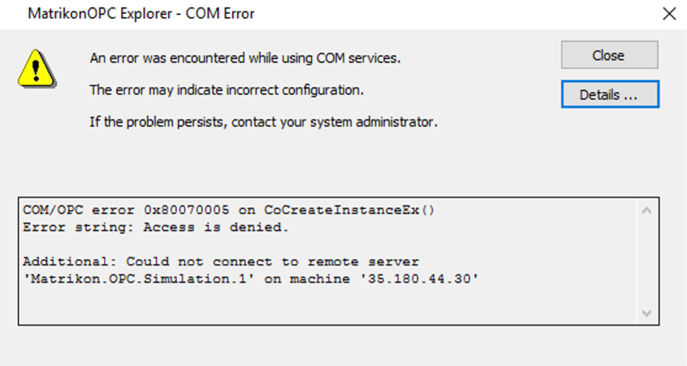
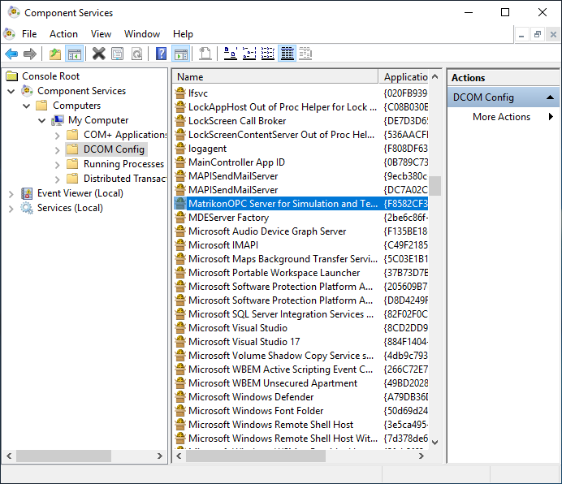

# OPC Classic™

OIBus agent 可以接收以下 [HTTP 调用](#http-api)。该 agent 通过进程间通信运行一个本地 HDA 模块。要使其正常运行，必须启用 [COM/DCOM](#comdcom-setup)。

## HTTP API {#http-api}

### 状态 {#status}

```bash
curl --location 'http://localhost:2224/api/opc/id/status'
```

### 连接 {#connection}

```bash
curl --location --request PUT 'http://localhost:2224/api/opc/id/connect' \
--header 'Content-Type: application/json' \
--data '{
    "host": "localhost",
    "serverName": "Matrikon.OPC.Simulation"
}'
```

### 读取 {#read}

```bash
curl --location --request PUT 'http://localhost:2224/api/opc/id/read' \
--header 'Content-Type: application/json' \
--data '{
    "host": "localhost",
    "serverName": "Matrikon.OPC.Simulation",
    "startTime": "2023-11-02T15:00:00.000Z",
    "endTime": "2023-11-02T16:00:00.000Z",
    "aggregate": "raw",
    "resampling": "none",
    "items": [
        {
            "name": "Random",
            "nodeId": "Random.Int1"
        },
        {
            "name": "Triangle Waves",
            "nodeId": "Triangle Waves.Int1"
        },
        {
            "name": "Saw-toothed Waves",
            "nodeId": "Saw-toothed Waves.Int1"
        }
    ]
}'
```

### 断开连接 {#disconnection}

```bash
curl --location --request DELETE 'http://localhost:2224/api/opc/id/disconnect'
```

## COM/DCOM 配置 {#comdcom-setup}

### 背景 {#background}

#### COM {#com}

COM 是位于同一台计算机上、但属于不同程序的对象之间进行通信的标准协议。服务器是提供服务（如提供可用数据）的对象。客户端是使用服务器所提供服务的应用程序。

#### DCOM {#dcom}

DCOM 是对 COM 功能的扩展，可实现对远程计算机上对象的访问。该协议支持工业、行政办公和制造业应用程序之间的标准化数据交换。

#### OPC {#opc}

OPC 客户端是一个访问 OPC 服务器的过程数据、消息和存档的应用程序。OPC 服务器是提供标准软件接口以读取或写入数据的程序。

:::info DCOM 连接
本页面提供了一些关于如何配置与 OPCHDA 服务器进行 COM/DCOM 通信的提示。但是，在工业环境中，正确设置权限、防火墙和 Windows 配置通常是 IT 团队的职责。
:::

### Windows 设置（客户端） {#windows-settings-client}

#### 客户端计算机设置 {#client-machine-settings}

请按照以下步骤在客户端启用 COM/DCOM 通信。首先，打开组件服务，并访问该计算机的 *属性*。

<div style={{ textAlign: 'center' }}></div>

请确保在该计算机上启用 *分布式 COM*（在 *默认属性* 选项卡中）。

<div style={{ textAlign: 'center' }}></div>

在 *COM 安全* 选项卡中，编辑默认的 *启动和激活权限*。

<div style={{ textAlign: 'center' }}></div>

在 *启动和激活权限* 窗口中，允许以下权限：

- 本地启动
- 远程启动
- 本地激活
- 远程激活

<div style={{ textAlign: 'center' }}></div>

#### 测试通信 {#test-communication}

DCOM 使用 HDA 服务器的 135 端口与客户端进行数据交换。要测试连通性：

```powershell
tnc localhost -port 135
```

<div style={{ textAlign: 'center' }}></div>

#### 身份验证 {#authentication}

OPCHDA 客户端程序将使用服务器的 IP 地址或主机名，加上服务器的 “progId”，与 DA/HDA 服务器进行通信。该用户必须在 HDA 服务器上是已知用户。

:::info 重要提示
该用户必须是 *Distributed COM Users* 组的成员
:::

:::tip 服务
如果程序通过服务（如 OIBus）运行，请将该服务配置为以特定用户身份运行。
:::

#### 防火墙配置 {#firewall-configuration}

通过在 135 端口添加一条规则来配置防火墙。

<div style={{ textAlign: 'center' }}>
  
</div>

对于 Lightsail 等云主机，需配置额外的防火墙规则：

<div style={{ textAlign: 'center' }}>
  
</div>

#### OPCEnum 工具 {#opcenum-tool}

[OPCEnum](https://opcfoundation.org/developer-tools/samples-and-tools-classic/core-components/) 工具允许 OPCHDA 客户端在远程节点上定位服务器。

##### RPC 不可用 {#rpc-unavailable}

如果 RPC 服务器不可用，请检查你的防火墙并再次测试通信。

<div style={{ textAlign: 'center' }}></div>

##### 访问被拒绝 {#access-denied}

如果访问被拒绝，请检查用户凭据和组成员身份。

<div style={{ textAlign: 'center' }}></div>

### 服务器设置 {#server-settings}

在 *组件服务* 窗口中检查 OPC 服务器应用程序是否已启用 DCOM。

<div style={{ textAlign: 'center' }}>
  
</div>
