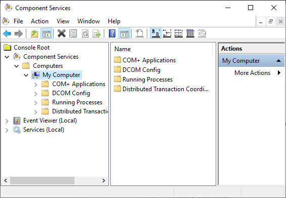
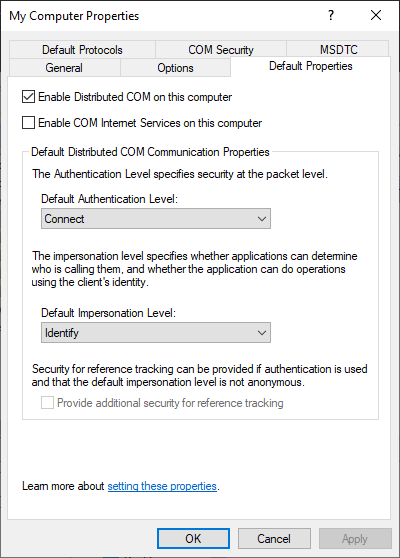
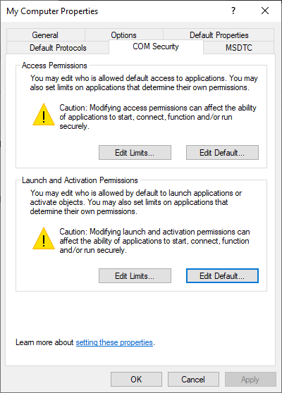
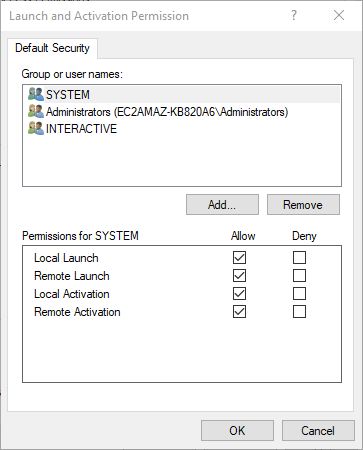
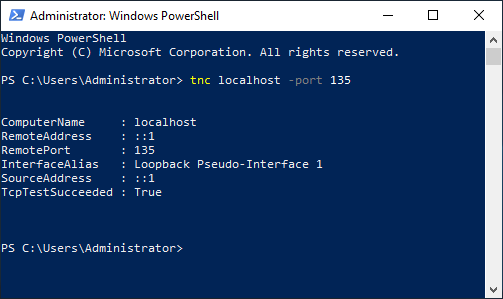
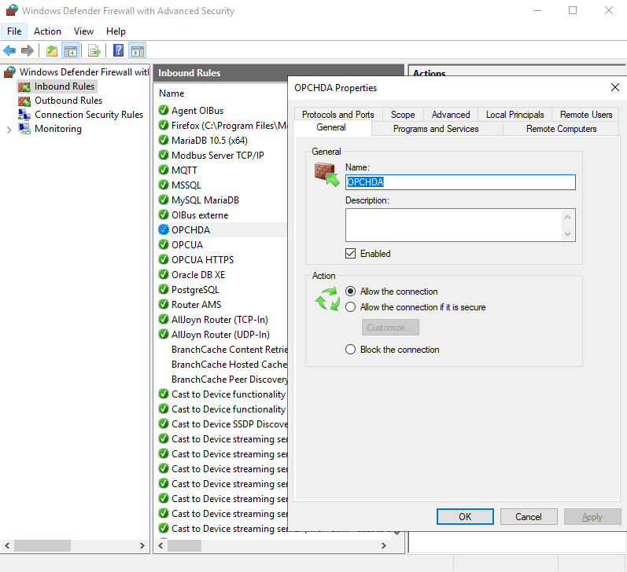
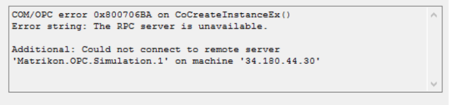
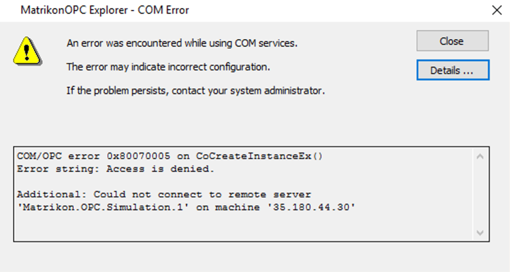
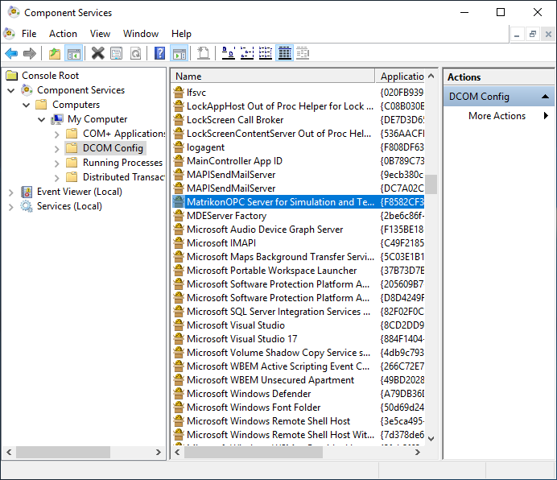

# OPCHDA
The OIBus agent can receive the following [HTTP calls](#http-api). The agent run a local HDA module through an inter-process 
communication.
To run properly, [COM/DCOM](#comdcom-setup) must be enabled. The HDA module can be found in the HdaAgent subfolder of
the OIBus Agent and can be run independently though the [command line](#hda-module).

:::caution OS compatibility
This feature is available only on Windows.
:::

## HTTP API
### Status
```
curl --location 'http://localhost:2224/api/opc/id/status'
```

### Connection
```
curl --location --request PUT 'http://localhost:2224/api/opc/id/connect' \
--header 'Content-Type: application/json' \
--data '{
    "host": "localhost",
    "serverName": "Matrikon.OPC.Simulation"
}'
```

### Read
```
curl --location --request PUT 'http://localhost:2224/api/opc/id/read' \
--header 'Content-Type: application/json' \
--data '{
    "host": "localhost",
    "serverName": "Matrikon.OPC.Simulation",
    "startTime": "2023-11-02T15:00:00.000Z",
    "endTime": "2023-11-02T16:00:00.000Z",
    "aggregate": "raw",
    "resampling": "none",
    "items": [
        {
            "name": "Random",
            "nodeId": "Random.Int1"
        },
        {
            "name": "Triangle Waves",
            "nodeId": "Triangle Waves.Int1"
        },
        {
            "name": "Saw-toothed Waves",
            "nodeId": "Saw-toothed Waves.Int1"
        }
    ]
}'
```

### Disconnection
```
curl --location --request DELETE 'http://localhost:2224/api/opc/id/disconnect'
```


## COM/DCOM setup
### Background
#### COM
COM is the standard protocol for communication between objects located on the same computer but which are part of
different programs. The server is the object providing services, such as making data available. The client is an
application that uses the services provided by the server.

#### DCOM
DCOM represents an expansion of COM functionality to allow access to objects on remote computers. This protocol allows
standardized data exchange between applications from industry, administrative offices and manufacturing. Previously, the
applications that accessed the process data were tied to the access protocols of the communication network. The OPC
standard software interface allows devices and applications from different manufacturers to be combined in a uniform way.

#### OPC
The OPC client is an application that accesses process data, messages, and archives of an OPC server. Access is through
the OPC software interface. An OPC server is a program that provides standard software interface to read or write data.
The OPC server is the intermediate layer between the applications for handling process data, the various network
protocols and the interfaces for accessing these data. Only devices with operating systems based on Windows COM and
DCOM technology can use the OPC software interface for data exchange.

:::info DCOM connectivity
This page gives some hints on how to set up a communication with COM/DCOM to an OPCHDA server. However, in industrial
context, it is often the responsibility of the IT team to correctly set the permissions, firewall and Windows
configuration.
:::

### Windows settings (client)
#### Client machine settings
Follow these steps to enable COM/DCOM communications from the client. First, open the Component services, and access the
_Properties_ of the computer.

<div style={{textAlign: 'center'}}>

  

</div>

Be sure to enable _Distributed COM_ on this computer (on the _Default Properties_ tab).

<div style={{textAlign: 'center'}}>

  

</div>

On the _COM Security_ tab, edit default _Launch and Activation Permissions_.

<div style={{textAlign: 'center'}}>

  

</div>


On the _Launch and Activation Permissions_ window, allow the following permissions:
- Local Launch
- Remote Launch
- Local Activation
- Remote Activation

<div style={{textAlign: 'center'}}>

  

</div>


#### Test communication
DCOM uses port 135 of the HDA server to exchange with the client. To do so, it is interesting to use the tnc command of
the Windows Powershell installed as standard. Below, a test that fails (because of the firewall) then a test that
succeeds:

`tnc localhost -port 135`

<div style={{textAlign: 'center'}}>

  

</div>

If you have a communication problem, see the [firewall configuration section](#firewall-configuration) which is probably
the source of the problem.

#### Authentication
An OPCHDA client program will communicate with the DA/HDA server with the IP address or hostname of the server followed
by the "progId" of the server. It will then have to be identified at the Windows level with a name and a password which
are (by default) those of the user who launches the client program. This user must therefore be known on the HDA
server as well. You must therefore either:
- Create a user with the same password on the HDA server (assuming it is accessible)
- Be part of the same domain (so the user is accessible from all computers in the domain)

:::info Important
The user must be a member of the _Distributed COM Users_ group
:::

:::tip Service
If the program runs through a service (such as OIBus), go to the Service manager window, and right-click on the service.
Then click on _Launch as user_.
:::

#### Firewall configuration
In case of communication issue, the most likely cause is the configuration of a firewall between the two computers
and/or at the hosting company in the case of machines on the cloud. On a Windows server, it is possible to configure
the firewall by adding a rule on port 135.

<div style={{textAlign: 'center'}}>

  

</div>

In the case of a server hosted by Lightsail, there is an additional firewall in which a custom rule must be configured
for port 135.

<div style={{textAlign: 'center'}}>

  

</div>


#### OPCEnum tool
The OPC Foundation has provided a tool to allow OPCHDA clients to locate servers on remote nodes, without having
information about those servers in the local registry. This tool is called [OPCEnum](https://opcfoundation.org/developer-tools/samples-and-tools-classic/core-components/)
and is freely distributed by the OPC Foundation. The PI OPCHDA interface installation installs OPCEnum as well. The
primary function of OPCEnum is to inform or request information from other instances of OPCEnum about existing OPCHDA
Servers on the local system. When OPCEnum is installed, it grants Launch and Access DCOM permission to _Everyone_ and
sets the _Authentication level_ to NONE. This allows access to any user who can log on to the system. The permissions
can be changed using `dcomcnfg.exe`.

##### RPC unavailable
If the RPC server is unavailable, try again testing COM/DCOM communication
[testing COM/DCOM communication](#test-communication) and check your firewall.

<div style={{textAlign: 'center'}}>

  

</div>


##### Access denied
Access rights can be diagnosed using the server security log. If the following error happens, check the user and its
password created on the HDA server and that the user is in the _Distributed COM Users_ group on the HDA server.

<div style={{textAlign: 'center'}}>

  

</div>

### Server settings
Check on the server machine if DCOM is enabled for the OPC Server application by opening the _Component Service_ window.
Here is an example with MatrikonOPC Server.
<div style={{textAlign: 'center'}}>

  

</div>

## HDA module
The agent is an executable that requires the following DLLs to run:
- CommandLine.dll
- Newtonsoft.Json.dll
- OpcComRcw.dll
- OpcNetApi.Com.dll
- OpcNetApi.dll

Several actions are possible:
- ping: to check connection and gives server information
- catalog: to list available tags and store them in a CSV file
- bulk: to request history and store it in one file per tag

The following options are available for all commands:

````
-h --host                   Host name (or IP address).
-s --server                 HDA Server name (ex: Matrikon.OPC.Simulation.1)
-l --consoleLevel           Verbosity level for Console (error, warning, info, debug, trace). Default debug
-x --fileLevel              Verbosity level for File (error, warning, info, debug, trace). Default debug
````

### ping
The following option is available:
````
-i --infos              Display supported aggregates and attributes from the server. Default: false
````

#### Usage
````
.\HdaAgent.exe ping -h localhost -s Matrikon.OPC.Simulation -i
````

The ping command with the _-i_ option returns three messages from the Matrikon simulation server:

**Status infos:**
````
{
    "VendorInfo": "Matrikon Inc +1-780-945-4011 http://www.matrikonopc.com",
    "ProductVersion": "1.7.7433",
    "ServerState": 1,
    "StatusInfo": "",
    "StartTime": "2022-05-16T14:27:46.3709266+00:00",
    "CurrentTime": "2022-08-02T09:18:29.5739742+00:00",
    "MaxReturnValues": 0
}
````

**Supported aggregates**
````
[
    {
        "ID": 1,
        "Name": "INTERPOLATIVE",
        "Description": "Retrieve interpolated values."
    },
    {
        "ID": 4,
        "Name": "TIMEAVERAGE",
        "Description": "Retrieve the time weighted average data over the resample interval."
    },
    {
        "ID": 7,
        "Name": "MINIMUMACTUALTIME",
        "Description": "Retrieve the minimum value in the resample interval and the timestamp of the minimum value."
    },
    {
        "ID": 8,
        "Name": "MINIMUM",
        "Description": "Retrieve the minimum value in the resample interval."
    },
    {
        "ID": 9,
        "Name": "MAXIMUMACTUALTIME",
        "Description": "Retrieve the maximum value in the resample interval and the timestamp of the maximum value."
    },
    {
        "ID": 10,
        "Name": "MAXIMUM",
        "Description": "Retrieve the maximum value in the resample interval."
    }
]
````

**Supported types:**
````
[
    {
        "ID": 1,
        "Name": "DATA_TYPE",
        "Description": "Data type",
        "DataType": "System.Int16, mscorlib, Version=4.0.0.0, Culture=neutral, PublicKeyToken=b77a5c561934e089"
    },
    {
        "ID": 2,
        "Name": "DESCRIPTION",
        "Description": "Item Description",
        "DataType": "System.String, mscorlib, Version=4.0.0.0, Culture=neutral, PublicKeyToken=b77a5c561934e089"
    },
    {
        "ID": 11,
        "Name": "NORMAL_MAXIMUM",
        "Description": "High EU",
        "DataType": "System.Double, mscorlib, Version=4.0.0.0, Culture=neutral, PublicKeyToken=b77a5c561934e089"
    },
    {
        "ID": 12,
        "Name": "NORMAL_MINIMUM",
        "Description": "Low EU",
        "DataType": "System.Double, mscorlib, Version=4.0.0.0, Culture=neutral, PublicKeyToken=b77a5c561934e089"
    },
    {
        "ID": 13,
        "Name": "ITEMID",
        "Description": "Item ID",
        "DataType": "System.String, mscorlib, Version=4.0.0.0, Culture=neutral, PublicKeyToken=b77a5c561934e089"
    },
    {
        "ID": -5,
        "Name": "TRIANGLE",
        "Description": "Triangle Wave",
        "DataType": "Opc.Type, OpcNetApi, Version=2.1.0.0, Culture=neutral, PublicKeyToken=9a40e993cbface53"
    },
    {
        "ID": -4,
        "Name": "SQUARE",
        "Description": "Square Wave",
        "DataType": "Opc.Type, OpcNetApi, Version=2.1.0.0, Culture=neutral, PublicKeyToken=9a40e993cbface53"
    },
    {
        "ID": -3,
        "Name": "SAWTOOTH",
        "Description": "Saw-toothed Wave",
        "DataType": "Opc.Type, OpcNetApi, Version=2.1.0.0, Culture=neutral, PublicKeyToken=9a40e993cbface53"
    },
    {
        "ID": -2,
        "Name": "RANDOM",
        "Description": "Random",
        "DataType": "Opc.Type, OpcNetApi, Version=2.1.0.0, Culture=neutral, PublicKeyToken=9a40e993cbface53"
    },
    {
        "ID": -1,
        "Name": "BUCKET",
        "Description": "Bucket Brigade",
        "DataType": "Opc.Type, OpcNetApi, Version=2.1.0.0, Culture=neutral, PublicKeyToken=9a40e993cbface53"
    }
]
````

### catalog
HdaAgent Catalog creates a csv file catalog.csv using the browse API.

The program displays information about the server (API ServerStatus), Aggregates (getAggregates)
and Attributes (getAttributes) as JSON string in the console.

The following options are available:
````
-i --includesAll        Includes all Items in the server (i.e. folders). Default: false
-f --file               Name of the output folder. Default: catalog.csv
````

#### Basic usage
`.\HDAAgent.exe catalog -h localhost -s Matrikon.OPC.Simulation`

````
Name,Address
"ArrayOfReal8","Bucket Brigade.ArrayOfReal8"
"ArrayOfString","Bucket Brigade.ArrayOfString"
...
````

#### Includes all and specific file
`.\HDAAgent.exe catalog -h localhost -s Matrikon.OPC.Simulation --includesAll --file myFile.csv`

````
Name,Address,isItem
"Root","",False
"Simulation Items,"Simulation Items",False
"Bucket Brigade","Bucket Brigade",False
"ArrayOfReal8","Bucket Brigade.ArrayOfReal8",True
"ArrayOfString","Bucket Brigade.ArrayOfString",True
...
````

### bulk
The following options are available:
````
-b --startTime          Start Time of the history      
-e --endTime            End Time of the history
-d --delay              Throttle: add a delay between requests to minimize load on HDA Servers (in ms)
-m --max                Maximum number of values returned in a request. Defaut 0 (no maximum)
-o --output             Name of the output folder. Default current folder
-c --catalog            Name of the catalog file listing the tags
-a --aggregate          Aggregate value. RAW=0, TOTAL=2, AVERAGE=3, MINIMUM=8, MAXIMUM=10, START=11, END=12. Default 0
-i --interval           Interval (in second) if an aggregate is requested
````
#### Basic usage
Request raw values from _Matrikon.OPC.Simulation_ server located on _localhost_, for points listed in catalog.csv between
2022-01-01 00:00:00 and 2022-02-01 00:00:00.
````
.\HdaAgent.exe bulk -h localhost -s Matrikon.OPC.Simulation -c catalog.csv -b "2022-01-01 00:00:00" -e "2022-02-01 00:00:00" -a 0
````
#### With aggregates
Request by group intervals of 60s (_-i 60_) the last value (_-a 12_) of each group for points listed in catalog.csv from
_Matrikon.OPC.Simulation_ server located on _localhost_, between  2022-01-01 00:00:00 and 2022-02-01 00:00:00. Display all logs in the console with trace
````
.\HdaAgent.exe bulk -h localhost -s Matrikon.OPC.Simulation -c catalog.csv -b "2022-01-01 00:00:00" -e "2022-02-01 00:00:00" -a 12 -i 60 -l trace
````
