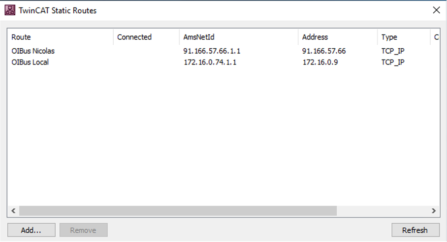
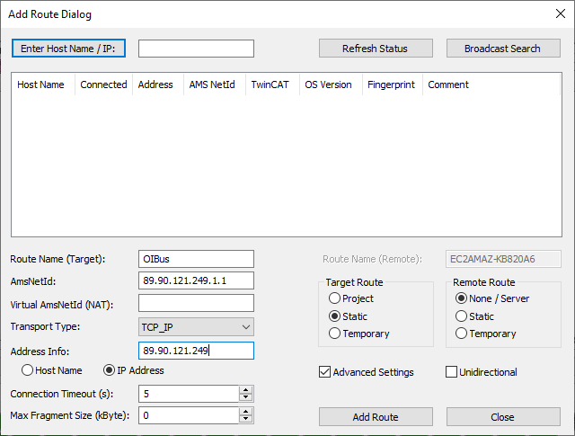

# TwinCAT® ADS

**自动化设备规范（Automation Device Specification，ADS）** 协议是集成在 TwinCAT® 系统中的传输层，由 Beckhoff 开发。它使
OIBus 能够通过控制器中每个数据项的唯一地址来访问 PLC 数据。

OIBus 使用 [ads-client](https://github.com/jisotalo/ads-client) 库与 TwinCAT® 系统进行通信。

## 特定设置 {#specific-settings}

### 连接 {#connection}

#### 本地 AMS 服务器（TwinCAT 运行时） {#local-ams-server-twincat-runtime}

如果 TwinCAT 与 OIBus 安装在同一台机器和网络上，请使用此配置。

**本地 AMS 服务器设置**

| 设置    | 说明                                             | 示例值            |
| ------- | ------------------------------------------------ | ----------------- |
| Net ID  | PLC 的唯一地址，类似于带有两个附加数字值的 IP 地址。 | `127.0.0.1.1.1`   |
| Port    | PLC 的通信端点。                                  | `851`             |

> **注意**：使用本地 AMS 服务器时，无需指定路由器地址、路由器 TCP 端口、客户端 AMS Net ID 或客户端 ADS 端口。

#### 远程 AMS 服务器 {#remote-ams-server}

如果 TwinCAT 安装在远程机器上，请使用此配置。

**远程 AMS 服务器设置**

| 设置             | 说明                                                       | 示例值              |
| ---------------- | ---------------------------------------------------------- | ------------------- |
| Net ID           | PLC 的唯一地址。                                            | `192.168.1.10.1.1`  |
| Port             | PLC 的通信端点。                                            | `851`               |
| Router Address   | AMS 路由器的 IP 地址或域名。                                | `192.168.1.100`     |
| Router TCP Port  | AMS 路由器用于通信的端口。                                   | `48898`             |
| AMS Net ID       | 用于连接到 TwinCAT 运行时的客户端标识符。                     | `192.168.1.50.1.1`  |
| ADS Client Port  | （可选）客户端使用的端口。如果留空，AMS 服务器将分配一个随机端口。 | `1200`              |

:::caution 静态路由
要启用通信，请使用 _TwinCAT Static Routes_ 工具配置**静态路由**。该工具中指定的
**AMS Net ID** 必须与 OIBus 配置中的一致。
:::

:::danger
OIBus 一次仅支持**一个远程 ADS 连接器**。要同时连接多个 PLC，请使用本地 AMS 服务器。
:::

### 高级设置 {#advanced-settings}

**高级设置**

| 设置              | 说明                                                                                      | 示例值    |
| ----------------- | ----------------------------------------------------------------------------------------- | --------- |
| Retry Interval    | 重试连接前等待的时间（以毫秒为单位）。                                                     | `10000`   |
| PLC Name          | 添加到每个项目名称前面的前缀（例如 `PLC001.MyVariable.Value`）。用于在 North 缓存或导出中区分来自多个 PLC 的数据。 | `PLC001.` |
| Enumeration Value | 选择将枚举序列化为整数还是文本。                                                            | `text`    |
| Boolean Value     | 选择将布尔值序列化为整数还是文本。                                                          | `integer` |

#### 结构体过滤 {#structure-filtering}

| 设置           | 说明                                                     | 示例值             |
| -------------- | -------------------------------------------------------- | ------------------ |
| Structure Name | 要过滤的结构体名称。                                       | `MyStructure`      |
| Fields to Keep | 要从结构体中获取的字段的逗号分隔列表，或使用 `*` 保留所有字段。 | `MyDate,MyNumber`  |

> **示例**：如果 `MyVariable` 是类型为 `MyStructure` 的变量，具有 `MyDate`、`MyNumber` 和 `Value` 字段，
> 过滤后仅保留 `MyDate, MyNumber` 将生成唯一的点 ID：
>
> - `MyVariable.MyDate`
> - `MyVariable.MyNumber`

:::tip 保留所有字段
将 **Fields to Keep** 设置为 `*` 即可保留结构体的所有字段，而无需逐一列出。
:::

## 项目设置 {#item-settings}

| 设置    | 说明                     | 示例值             |
| ------- | ------------------------ | ------------------ |
| Address | 要查询数据的 PLC 地址。   | `MAIN.MyVariable`  |
