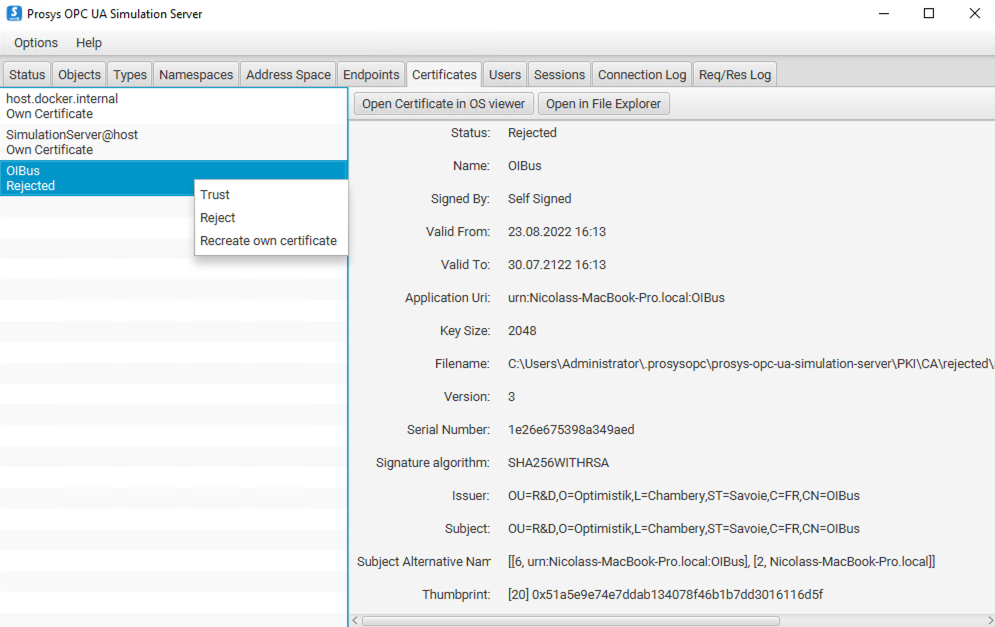

# OPCUA
OPCUA，即OPC统一架构，是一个旨在读写模式下访问数据的协议。数据在类似树的地址空间中组织，并使用被称为节点ID的唯一标识符引用。OPCUA是基于TCP/IP的现代标准，已取代了早期的OPC HDA/DA技术（参见[OPCHDA连接器](./opc-hda.md)）。它通常天然嵌入于工业控制器中。

OPCUA包含了两种协议变体：HA（历史访问）和DA（数据访问）。在HA模式下，您可以访问指定时间间隔内请求数据点的值历史，在DA模式下，您可以在每个请求时访问值，或监听值的变化。

OIBus集成了两种OPCUA模式（HA和DA），仅用于只读模式，使用[node-opcua库](https://github.com/node-opcua/node-opcua)。

## 特定设置
为了建立与OPCUA服务器的连接，OIBus需要几个设置：
- **URL**：用于连接服务器的字符串，其格式为 `opc.tcp://<host>:<port>/<server-name>`。
- **重试间隔**：连接失败时，重连尝试之间的等待时间。
- **安全模式**：可以使用安全模式和安全策略字段来保护通信。可用的安全模式包括：_None_（无）、_Sign_（签名）、_SignAndEncrypt_（签名并加密）。
- **安全策略**（当安全模式不是None时适用）：安全策略定义了通信的安全级别。可用的安全策略包括：None、Basic128、Basic192、Basic256、Basic128Rsa15、Basic192Rsa15、Basic256Rsa15、Basic256Sha256、Aes128_Sha256_RsaOaep、PubSub_Aes128_CTR、PubSub_Aes256_CTR。
- **认证**：认证选项包括None（无）、Basic（基础）和Certificate（证书）。详情请参考[安全设置](#认证)。

:::caution 与OPCUA服务器的兼容性
选择与您要连接的OPCUA服务器支持的安全模式和安全策略至关重要，确保兼容性对于成功连接至关重要。
:::

## 项设置
在配置每个项以在JSON有效载荷中检索数据时，您需要指定以下特定设置：
- **节点ID**：节点ID对应于OPCUA服务器上适当命名空间中数据的路径。考虑服务器支持的节点格式非常重要，它可能使用数字或字符串。例如，在Prosys上，`ns=3;i=1001` 与 `ns=3;s=Counter`相匹配。
- **模式**：根据您的需求，您可以选择HA（历史访问）或DA（数据访问）模式。
- **聚合**（仅在HA模式下）：在HA模式下，有一个选项可以在请求的间隔期间对检索的值进行聚合。
- **重采样**（仅在HA模式下）：同样，在HA模式下，您可以选择在请求的间隔期间对检索的值进行重采样。

:::caution 与OPCUA服务器的兼容性
需要注意的是，并非所有的聚合和重采样选项都被OPCUA服务器支持。为了避免兼容性问题，建议尽可能使用`Raw`聚合和`None`重采样。另外，请确保所选的模式（HA或DA）由您正在连接的服务器支持。
:::

项的名称将在JSON有效载荷中，特别是在北向应用的`pointID`字段中用作参考。

## 安全设置
### 通信
使用除_None_之外的安全模式时，需要一个证书来签名并可能加密通信。OIBus在启动时生成了一个自签名证书，用于保护与OPCUA服务器的通信。您可以在南向缓存的`opcua`文件夹中找到OPCUA使用的证书。这个证书必须得到OPCUA服务器的信任，以启用安全通信。

:::info 在Prosys OPCUA模拟服务器上的示例

如果证书没有被OPCUA服务器信任，您可能会遇到包含信息：`Error: The connection may have been rejected by the server` 的错误。
:::

### 认证
用于客户端认证的证书必须添加到OPCUA服务器的信任用户证书列表中。它与前面提到的用于[保护通信](#通信)的自签名证书分开管理。

:::info 在Prosys OPCUA模拟服务器上的示例
对于Prosys OPC UA服务器，用于认证OIBus的证书必须放置在`.prosysopc\prosys-opc-ua-simulation-server\USERS_PKI\CA\certs`文件夹中。如果不这样做，可能会出现包含信息：`Error: serviceResult = BadIdentityTokenRejected (0x80210000)` 的错误。

如果之前已经尝试过连接并被拒绝，您应该从**拒绝证书**文件夹（`.prosysopc\prosys-opc-ua-simulation-server\USERS_PKI\CA\rejected`）中删除证书，并将其移动到**信任**文件夹（`.prosysopc\prosys-opc-ua-simulation-server\USERS_PKI\CA\certs`）。
:::

### 使用相同证书进行用户认证和安全通信
同一个证书可以用于签名和加密操作以及认证。为此，必须指定`cert.pem`和`private.pem`文件的路径。它们位于南向数据流文件夹的opcua目录中。

在OPCUA服务器端，自签名证书（`cert.pem`）必须被复制到用户证书文件夹中。

例如，在Prosys OPCUA模拟服务器上：`.prosysopc\prosys-opc-ua-simulation-server\USERS_PKI\CA\certs`。

## 使用ProSys OPC UA模拟服务器的证书
您可以创建您的自签名证书来认证OIBus，使用**Cert**方法。

1. 创建一个cert.conf文件：
```
[ req ]
default_bits = 2048
default_md = sha256
distinguished_name = subject
req_extensions = req_ext
x509_extensions = req_ext
string_mask = utf8only
prompt = no

[ req_ext ]
basicConstraints = CA:FALSE
nsCertType = client, server
keyUsage = nonRepudiation, digitalSignature, keyEncipherment, dataEncipherment, keyCertSign
extendedKeyUsage= serverAuth, clientAuth
nsComment = "OIBus User Cert"
subjectKeyIdentifier=hash
authorityKeyIdentifier=keyid,issuer
subjectAltName = URI:urn:opcua:user:oibus,IP: 127.0.0.1

[ subject ]
countryName = FR
stateOrProvinceName = FR
localityName = Chambéry
organizationName = OI
commonName = oibus
```
2. 使用`cert.conf`创建一个私钥和证书：
```
openssl req -new -x509 -keyout oibus.key -out oibus.pem -config cert.conf
```
3. 移除私钥密码短语：
```
openssl rsa -in oibus.key -out oibus.key
```
4. 为ProSys创建DER证书：
```
openssl x509 -inform PEM -outform DER -in oibus.pem -out oibus.der
```
5. 将DER证书复制到ProSys USERS_PKI证书文件夹：`prosys-opc-ua-simulation-server\USERS_PKI\CA\certs`