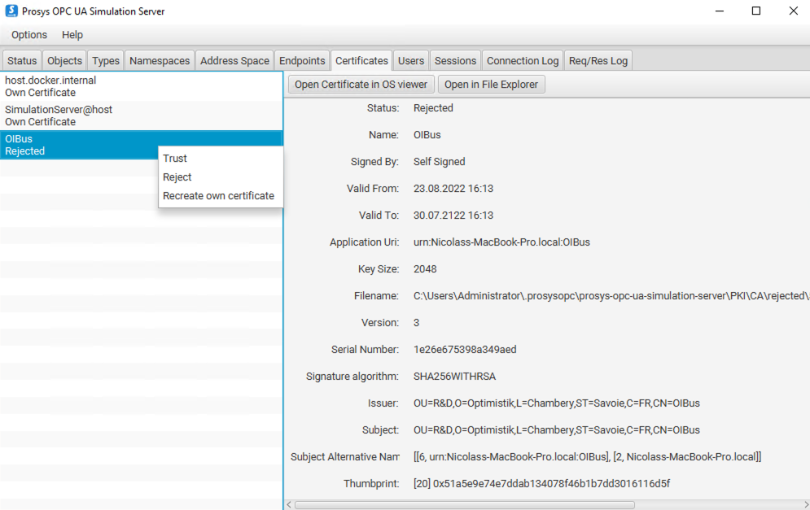

import ThrottlingSettings from './_throttling-settings.mdx';

# OPC UA™

OPC 统一架构（OPC UA）协议，用于以只读模式安全访问工业数据，同时支持历史访问（HA）和数据访问（DA）模式。

:::info 技术概览

- OPC Classic™ 的现代继任者（参见 [OPC Classic™ 连接器](./opc.mdx)）
- 基于 TCP/IP，采用树状地址空间
- 使用节点 ID 引用数据
- 使用 [node-opcua 库](https://github.com/node-opcua/node-opcua) 实现
- 已原生嵌入到许多工业控制器中
  :::

## OPC Classic 与 OPC UA 对比 {#opc-classic-vs-opc-ua}

|              | OPC Classic™                                                                       | OPC UA                                                              |
| ------------ | ------------------------------------------------------------------------------------ | --------------------------------------------------------------------- |
| **标准**     | 三个独立规范：**DA**（实时数据）、**HDA**（历史数据）、**AE**（报警与事件）          | 统一标准：**DA**（实时数据）+ **HA**（历史访问）+ 报警                |
| **历史模式名称** | **HDA** —— 历史数据访问                                                          | **HA** —— 历史访问（OPC UA Part 11）。概念相同，名称不同 —— 见下方说明 |
| **传输方式** | COM/DCOM —— 仅限 Windows 进程间通信                                                  | TCP/IP 或 HTTPS —— 可在任何 IP 网络上工作                             |
| **平台**     | 仅限 Windows                                                                         | 跨平台：Windows、Linux、macOS、嵌入式设备                             |
| **安全性**   | 依赖 Windows 域/DCOM 安全机制                                                       | 内置：消息签名、加密、基于证书的身份验证                              |
| **推出时间** | 1996 年                                                                              | 2006 年                                                               |
| **OIBus 要求** | 需要在托管 OPC 服务器的 Windows 机器上运行 [OIBus Agent](../oibus-agent/installation.mdx) | 由 OIBus 直接连接 —— 无需 Agent                                       |

:::note HDA 与 HA —— 命名上的混淆
来自 OPC Classic 背景的用户经常在 OPC UA 中寻找 **HDA**，却找不到。
OPC UA 将等效功能重命名为 **HA**（历史访问，定义于 OPC UA Part 11）。
概念完全相同 —— 都是向服务器查询过去记录的值 —— 但缩写发生了变化。
在 OIBus 中，OPC Classic 连接器将该模式称为 `HDA`，而 OPC UA 连接器称为
`HA`。不要将 OPC UA 的 HA 与 OPC Classic 的 HDA 混淆：它们是相互**不可
互操作**的独立协议。
:::

**选择 OPC Classic**：当您的基础设施已经运行无法迁移的 OPC DA 或 OPC HDA 服务器时。必须在托管这些服务器的 Windows 机器上部署 OIBus Agent。

**选择 OPC UA**：适用于任何新部署。OPC UA 是当前的行业标准：跨平台、对网络友好，并内置原生安全机制。

## 常见 OPC UA 服务器 {#common-opc-ua-servers}

| 服务器                                                                                                         | 供应商                | 模式    | 说明                                                                                                                                         |
| ---------------------------------------------------------------------------------------------------------------- | -------------------- | ------ | --------------------------------------------------------------------------------------------------------------------------------------------- |
| [S7-1500 / S7-1200](https://www.siemens.com/global/en/products/automation/systems/industrial/plc/s7-1500.html) | Siemens              | DA     | 内置于现代西门子 PLC 的原生 OPC UA 服务器 —— 无需额外软件。较旧的 S7-300/400 则改用 SIMATIC NET 通过 OPC Classic 访问                       |
| [KEPServerEX](https://www.ptc.com/en/products/kepware/kepserverex)                                             | PTC（Kepware）        | DA     | 除 OPC Classic 接口外，也暴露 OPC UA 端点 —— 是有用的过渡方案                                                                                |
| [Ignition](https://inductiveautomation.com/ignition/)                                                          | Inductive Automation | DA     | 内置 OPC UA 服务器的流行 SCADA 平台                                                                                                          |
| [PI Server](https://www.aveva.com/en/products/aveva-pi-system/)                                                | AVEVA（OSIsoft）      | DA、HA | 同时也暴露 OPC Classic HDA 接口 —— 参见 OPC Classic 连接器页面                                                                                |
| [OPC UA Simulation Server](https://www.prosysopc.com/products/opc-ua-simulation-server/)                       | Prosys               | DA、HA | 免费仿真服务器；非常适合在连接实际服务器之前测试 OIBus 配置                                                                                  |

## 专有设置 {#specific-settings}

### 连接配置 {#connection-configuration}

| 设置                                     | 说明                                                                                                        | 示例值                     |
| ------------------------------------------- | ------------------------------------------------------------------------------------------------------------- | -------------------------- |
| **端点 URL**                              | OPC UA 服务器的 URL。                                                                                          | `opc.tcp://localhost:4840` |
| **保持会话存活**                          | 在消息之间保持会话存活。                                                                                       | Enabled/Disabled           |
| **重试间隔**                              | 重试之间的延迟（毫秒）。                                                                                       | `5000`                     |
| **读取超时**                              | 请求的最大执行时间（毫秒）。                                                                                   | `15000`                    |
| **最大并行查询数**（`maxParallelRun`）    | OIBus 针对该服务器允许并发运行的项目/组查询的最大数量。从 `1`（完全串行）到 `32`。                             | `1`                        |

### 并行查询 {#parallel-queries}

默认情况下（**最大并行查询数** = `1`），OIBus 会按顺序、一次一个地查询该连接器的项目和组，即使多个查询同时到期也是如此。提高该设置可让 OIBus 并发流水线化最多该数量的查询，这在许多项目/组使用较短扫描模式、依次排队会导致落后的情况下会有所帮助。

所有并发查询共用**同一个 OPC UA 会话** —— OIBus 不会为每次查询单独打开一个会话。单个会话本身即可安全地支持重叠的运行中请求，而许多 OPC UA
服务器（尤其是嵌入在 PLC 中的服务器）会将每个客户端的并发会话数限制在一个较低的数值，有时正好是一，因此共用一个会话可以避免触及该上限。**最大并行查询数**
只是限制了在该共用会话上同时可以流水线化的请求数 —— 它不会打开额外的会话。

:::tip 逐步提高
每一个并发查询仍会对同一底层连接及服务器本身增加负载。
请逐步提高**最大并行查询数**，并观察服务器响应时间和连接器的
日志 —— 处理能力有限的服务器，即使技术上允许更多并发查询，也可能在较低的值下响应更好。
:::

### 数据限流 {#data-throttling}

| 设置                 | 说明                                                       | 示例值 |
| -------------------- | ------------------------------------------------------------ | ------ |
| 刷新前的消息数量     | 刷新到 North 缓存之前累积的消息数量                          | `1000` |
| 刷新间隔             | 自动刷新累积消息之间的时间延迟（毫秒）                        | `1000` |

### 安全设置 {#security-settings}

| 设置                 | 说明                                                       | 示例值                                               |
| -------------------- | ------------------------------------------------------------ | --------------------------------------------------- |
| **安全模式**         | 连接的安全模式。                                              | `None`、`Sign`、`Sign and encrypt`                   |
| **安全策略**         | 连接的安全策略。完整列表见下方说明。                          | `None`、`Basic256-SHA256`、`AES128-SHA256-RSA-OAEP` |

:::note 安全策略值

| 值                     | 说明                                                                                                                 |
| ---------------------- | --------------------------------------------------------------------------------------------------------------------------- |
| None                   | 无安全性。数据以未加密方式传输，且没有消息身份验证。                                                                |
| Basic128               | AES-128 加密，HMAC-SHA1 签名，RSA-1024 密钥交换。                                                                    |
| Basic192               | AES-192 加密，HMAC-SHA1 签名，RSA-1024 密钥交换。                                                                    |
| Basic256               | ⚠️ **已弃用。** AES-256 加密，HMAC-SHA1 签名。请避免使用 —— SHA-1 在密码学上较弱。                                  |
| Basic128-RSA15         | ⚠️ **已弃用。** AES-128 加密，HMAC-SHA1 签名，RSA PKCS#1 v1.5 填充。请避免使用 —— SHA-1 和 RSA-1.5 均较弱。         |
| Basic192-RSA15         | AES-192 加密，HMAC-SHA1 签名，RSA PKCS#1 v1.5 填充。                                                                 |
| Basic256-RSA15         | AES-256 加密，HMAC-SHA1 签名，RSA PKCS#1 v1.5 填充。                                                                 |
| Basic256-SHA256        | AES-256 加密，HMAC-SHA256 签名，RSA-OAEP 填充。大多数部署**推荐**使用。                                              |
| AES128-SHA256-RSA-OAEP | AES-128 加密，SHA-256 签名，RSA-OAEP 填充。现代标准（OPC UA Part 2 rev. 1.05）。                                     |
| PubSub AES-128-CTR     | 用于 OPC UA Pub/Sub 模式的 AES-128-CTR 对称加密。                                                                     |
| PubSub AES-256-CTR     | 用于 OPC UA Pub/Sub 模式的 AES-256-CTR 对称加密。                                                                     |

:::

### 身份验证方式 {#authentication-methods}

| 设置           | 说明                                              | 示例值                                      |
| -------------- | --------------------------------------------------- | ------------------------------------------ |
| 身份验证       | OPC UA 服务器连接的身份验证方式。                    | `None`、`Username/Password`、`Certificate` |
| 用户名         | 用户名/密码身份验证的用户名。                        | `opc_user`                                 |
| 密码           | 用户名/密码身份验证的密码。                          | `••••••••`                                 |
| 证书文件路径   | 证书身份验证所用的客户端证书文件。                    | `/path/to/cert.pem`                        |
| 密钥文件路径   | 证书身份验证所用的私钥文件。                          | `/path/to/key.pem`                         |

## 组设置 {#group-settings}

项目被组织为**组**。每个组定义一个共享的调度计划，以及对于 HA 模式而言，该组内所有项目的默认限流参数。

| 设置          | 说明                                     | 示例值        |
| ------------- | ---------------------------------------- | ------------- |
| **名称**      | 该连接器内该组的唯一标签。               | `Group A`     |
| **扫描模式**  | 应用于该组内每个项目的采集调度。         | `Every 1 min` |

<ThrottlingSettings />

:::tip 按项目覆盖限流设置
每个项目都可以通过在项目编辑表单中禁用**与组同步**开关来覆盖组的默认限流设置。
:::

## 项目设置 {#item-settings}

| 设置             | 说明                                                                                          | 示例值                                           |
| ---------------- | ------------------------------------------------------------------------------------------------ | ----------------------------------------------- |
| 节点 ID          | OPC UA 服务器命名空间中数据点的路径。                                                             | `ns=3;i=1001`、`ns=3;s=Counter`                 |
| 模式             | 数据访问方式：`ha`（历史访问）或 `da`（数据访问）。                                               | `ha`、`da`                                      |
| 聚合方式         | 值聚合方法（仅 HA 模式）。                                                                        | `Raw`、`Average`、`Minimum`、`Maximum`、`Count` |
| 重采样           | 区间重采样（仅 HA 模式）。                                                                        | `None`、`1 second`、`1 hour`、`1 day`           |
| 时间戳来源       | 时间戳来源：`OIBus`（查询时间）、`Point`（服务器上报的时间戳）、`Server`（服务器当前时间）。       | `OIBus`、`Point`、`Server`                      |

:::caution 服务器兼容性

1. 请核实服务器支持所选模式（HA/DA）
2. 并非所有服务器都支持所有聚合/重采样选项
3. 推荐：使用 `Raw` 聚合和 `None` 重采样

:::

:::note 聚合值（HA 模式）

| 值      | 说明                             |
| ------- | ---------------------------------- |
| Raw     | 区间内所有原始值                   |
| Average | 算术平均值                         |
| Minimum | 区间内的最小值                     |
| Maximum | 区间内的最大值                     |
| Count   | 数据点数量                         |

:::

:::note 重采样值

`None` · `1 second` · `10 seconds` · `30 seconds` · `1 minute` · `1 hour` · `1 day`

:::

## 安全配置 {#security-configuration}

### 通信证书 {#communication-certificate}

当**安全模式**设置为 `Sign` 或 `Sign and Encrypt` 时，OIBus 使用证书向 OPC UA 服务器进行身份验证。该证书：

- 由 OIBus 在首次启动时**自动生成**（4096 位 RSA，自签名）
- **存放位置**：`<OIBusData>/certs/cert.pem` —— 私钥位于：`<OIBusData>/certs/private.pem`

在建立安全连接之前，**OPC UA 服务器必须信任该证书**。如果它不在服务器的信任存储中，OIBus 将记录以下日志：

```
The connection may have been rejected by the server
```

要授权该证书，请将 `<OIBusData>/certs/cert.pem` 导入或复制到服务器的可信证书存储中。



:::info Prosys 仿真服务器 —— 信任存储路径

- **已信任**：`.prosysopc\prosys-opc-ua-simulation-server\PKI\CA\trusted\certs\`
- **已拒绝**（从此处移动到已信任目录）：`.prosysopc\prosys-opc-ua-simulation-server\PKI\CA\rejected\`
  :::

### 身份验证证书 {#authentication-certificate}

当**身份验证**设置为 `Certificate` 时，您必须在连接器设置中（**证书文件路径**和**密钥文件路径**字段）提供一个单独的身份证书及其
私钥。该证书用于标识*用户*，与上文的传输安全证书相互独立。

服务器同样必须信任该身份证书。对于 Prosys，请将其导入到：

```
.prosysopc\prosys-opc-ua-simulation-server\USERS_PKI\CA\certs\
```

如果服务器拒绝该证书，OIBus 会记录 `BadIdentityTokenRejected (0x80210000)`。在 Prosys 中，被拒绝的身份
证书会存放在 `.prosysopc\prosys-opc-ua-simulation-server\USERS_PKI\CA\rejected\` 中 —— 请将它们移动到
旁边的 `certs\` 文件夹中。

:::tip 复用 OIBus 生成的证书用于身份验证
您可以将连接器的**证书文件路径**和**密钥文件路径**字段指向 OIBus 自己的证书
（`<OIBusData>/certs/cert.pem` 和 `<OIBusData>/certs/private.pem`），以便同一证书
同时用于传输层安全和用户身份验证。
:::

## 为 Prosys 创建自定义身份验证证书 {#creating-a-custom-authentication-certificate-for-prosys}

如果您需要一个专用的身份证书，用于验证 OIBus 的身份，而不仅仅是对通信进行签名，可以使用 OpenSSL
生成一个：

1. 创建 `cert.conf`：

```ini
[ req ]
default_bits = 2048
default_md = sha256
distinguished_name = subject
req_extensions = req_ext
x509_extensions = req_ext
string_mask = utf8only
prompt = no

[ req_ext ]
basicConstraints = CA:FALSE
nsCertType = client, server
keyUsage = nonRepudiation, digitalSignature, keyEncipherment, dataEncipherment, keyCertSign
extendedKeyUsage= serverAuth, clientAuth
nsComment = "OIBus User Cert"
subjectKeyIdentifier=hash
authorityKeyIdentifier=keyid,issuer
subjectAltName = URI:urn:opcua:user:oibus,IP: 127.0.0.1

[ subject ]
countryName = FR
stateOrProvinceName = FR
localityName = Chambéry
organizationName = OI
commonName = oibus
```

2. 生成证书并去除密码短语：

```bash
# Create key and certificate
openssl req -new -x509 -keyout oibus.key -out oibus.pem -config cert.conf

# Remove passphrase from key
openssl rsa -in oibus.key -out oibus.key

# Convert to DER format (required by some servers)
openssl x509 -inform PEM -outform DER -in oibus.pem -out oibus.der
```

3. 安装到 Prosys 的用户 PKI 存储中：

```bash
cp oibus.der ".prosysopc/prosys-opc-ua-simulation-server/USERS_PKI/CA/certs/"
```

然后，在 OIBus 连接器设置中，将**证书文件路径**设置为 `oibus.pem`，将**密钥文件路径**设置为 `oibus.key`。
