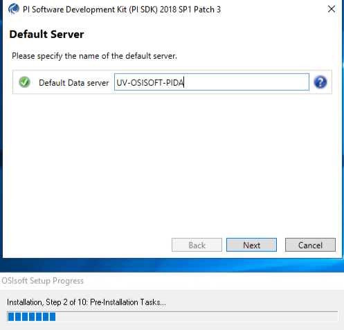
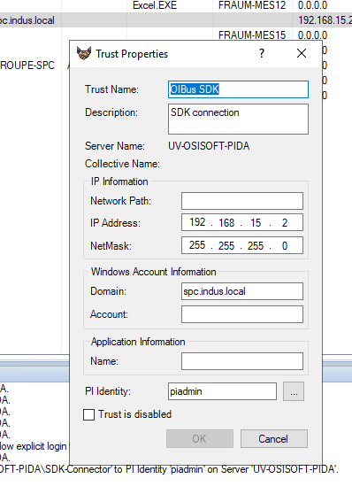
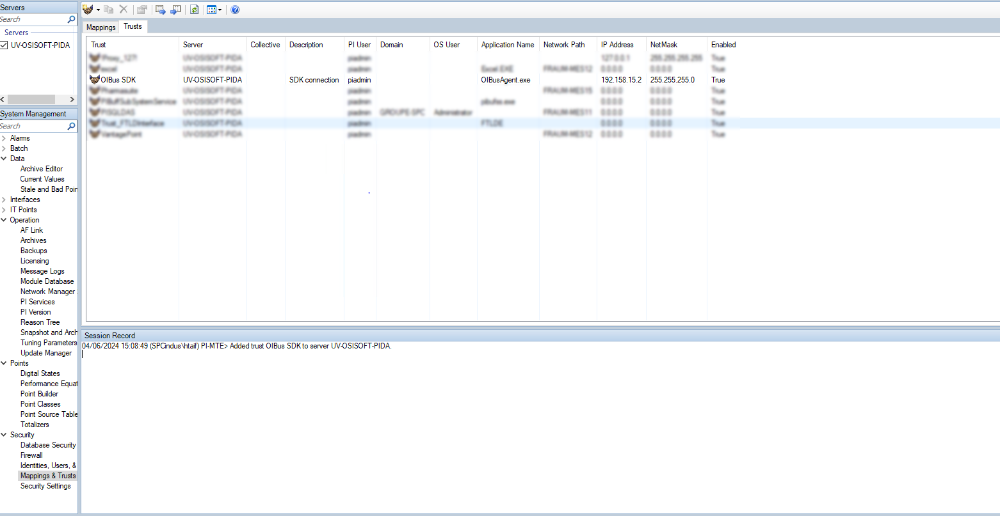
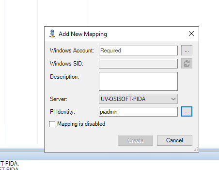
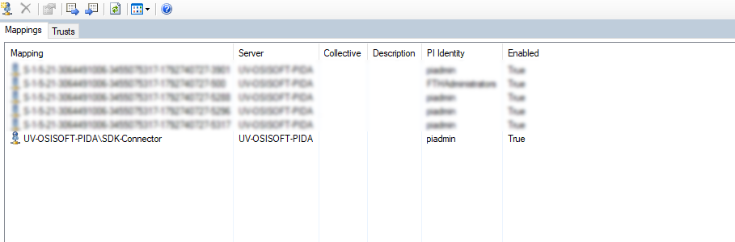

# OSIsoft PI

OSIsoft PI is a software platform used for collecting, and visualizing data from industrial operations. These data
can be retrieved through the OSIsoft PI driver embedded in our [OIBus Agent](../oibus-agent/installation.mdx), in a
dedicated PI module.

:::caution
The OIBus Agent must be installed on a Windows machine to use the PI module. It can be installed on the same machine as 
OSIsoft PI or on another machine with the [PI SDK properly configured](#osisoft-pi-sdk-configuration).
:::

## Specific settings
OIBus exchanges commands and data with the PI Agent through an HTTP communication. Therefore, several
fields must be filled to make OIBus communicate with the PI Agent:
- **Remote agent URL**: Specify the URL of the remote OIBus agent, e.g., `http://ip-address-or-host:2224`.
- **Retry interval**: Time to wait before retrying connection.

## Item settings
When configuring each item to retrieve data in JSON payload, you'll need to specify the following specific settings:
- **Type**: pointId to access a point through its fully qualified ID, or pointQuery to access a list of points that
- **Point ID**: The fully qualified ID of the point (without the server name)
- **Point Query**: A selector to access multiple points at once.
  See [this documentation](https://docs.aveva.com/bundle/af-sdk/page/html/pipoint-query-syntax-overview.htm#Examples)
  for example.

The name of the item will serve as a reference in JSON payloads if the type is pointId. For pointQuery items, the PI
name will be used as reference.

## OSIsoft PI SDK configuration
When the OIBus Agent is installed on the machine of OSIsoft PI, there is no need to set a connection between the agent 
and PI because de SDK is included in PI System Access (PSA).

However, some situations ask to install the OIBus Agent remotely, with the SDK.

### Installation
When installing the SDK, specify the default data server.

  

### User creation and configuration
Create a user account on the machine domain (this domain must be accessible from both machines). If the domain does
not exist and cannot be created, it is possible to create one user on each machine, with the same password.

OIBus Agent must be run with the user created on the previous step.

### Trust configuration
Open PI System Management Tools and create a trust from the `Mapping & Trusts` section, in the `Trusts` tab:
  - IP address and Net Mask of the OIBus Agent machine
  - Domain (if existing)
  - PI Identity: choose the identity that needs to connect into PI

  

The trust has been added on the trust list:

  

### Mapping creation
Still on the PI System Management Tools, create a mapping from the `Mapping & Trusts` section, in the `Mappings` tab:
  - Select the user used by the OIBus Agent service
  - PI Identity: the identity indicated in the trust

  

The mapping has been added on the mapping list:

  

:::tip Log access
It is possible to access the logs from PI System Management Tools in `Operation` → `Messages Logs`
:::
