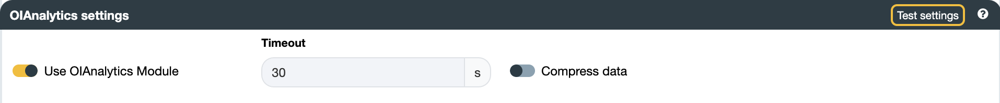

## 北向 OIAnalytics {#north-oianalytics}

在设置连接器之前，请先确认 OIBus 主机可以访问 OIAnalytics：在 OIBus 所在机器上打开浏览器，导航到 OIAnalytics 的 URL（例如 `https://instance.oianalytics.fr`）。如果页面无法加载，请让 IT 团队为该连接放行 — 问题通常出在域名防火墙规则上，较少见的情况是 HTTPS/443 端口规则的问题。

为获得最佳体验，建议在创建连接器之前先[将 OIBus 注册到 OIAnalytics](../guide/installation/oianalytics.mdx)。注册完成后，在连接器设置中启用**使用 OIAnalytics 注册**开关，即可自动管理凭据。

:::tip 测试连接
点击**测试设置**以在保存前验证连接。
:::
