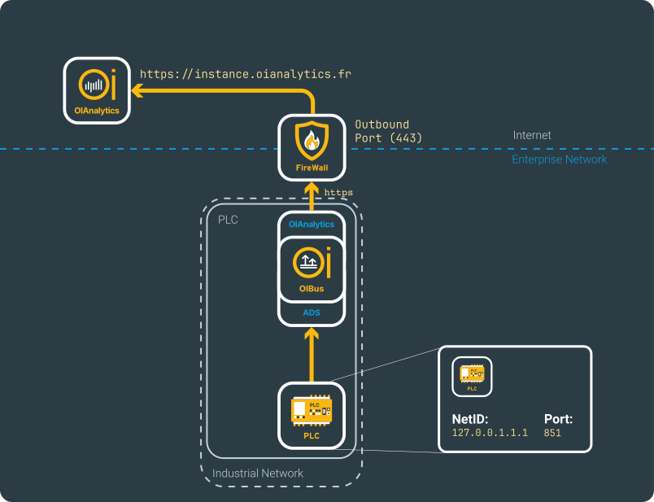
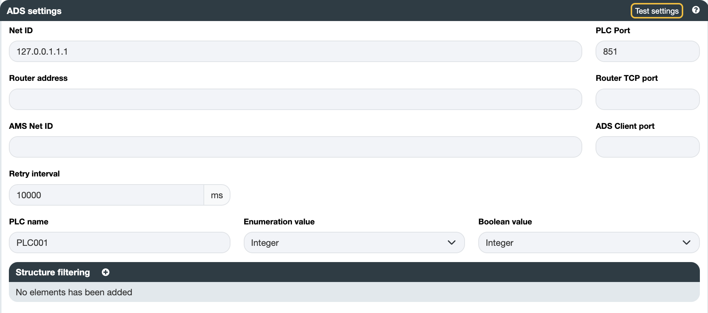
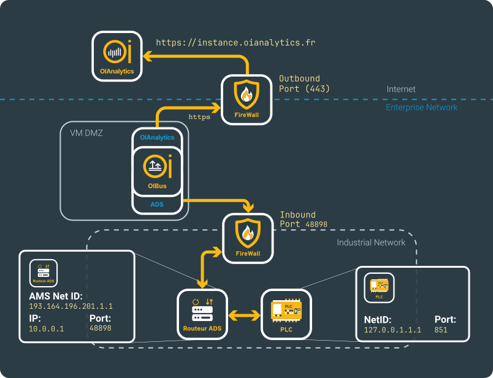
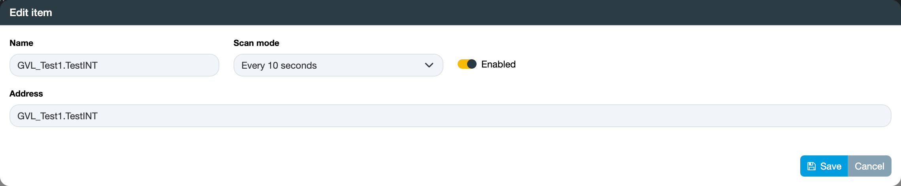

import NorthOIAnalytics from './_north_oianalytics.mdx';

# TwinCAT ADS → OIAnalytics
## Beforehand
This use case shows how to set up an ADS connector and how to send the resulting CSV files into OIAnalytics.

Details regarding the configurations can be located on the [North OIAnalytics](../guide/north-connectors/oianalytics.md)
and [South ADS](../guide/south-connectors/ads.md) connectors pages.

## South ADS
Ensure that you are familiar with the network configuration required to access the ADS server from the OIBus machine, as
detailed in the [connector documentation](../guide/south-connectors/ads.md#特定设置).

Let's consider two implementation scenarios:
1. OIBus directly installed in the PLC, which includes the ADS router.
2. OIBus installed on a separate machine, or on the same machine but without direct access to the ADS router,
which can be accessed via another local network.

### Local ADS
Lorem ipsum

  

    

  

Lorem ipsum

  

    

  

### Remote ADS
Lorem ipsum

  

    

  

Lorem ipsum

  

    

  

:::tip Testing connection
You can verify the connection by testing the settings using the `Test settings` button.
:::

### Items
Ensure that you are aware of all the addresses you intend to request. You have the option to associate an address with
a name to identify the corresponding data. The ADS connector is frequently employed for accessing PLCs, and there are
scenarios where multiple PLCs with the same namespace need to be accessed.

  

    

  

To streamline this process, OIBus allows you to import items from a CSV file, which can be the result of exporting from
another ADS connector. However, note that the names will be the same between the two connectors. To distinguish them,
utilize the `PLC name` field.

The PLC name will be appended in front of all item names, providing a unique identifier.

<NorthOIAnalytics></NorthOIAnalytics>