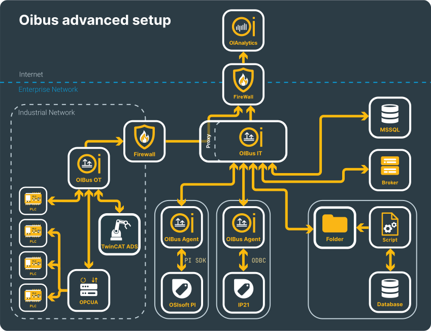

# Advanced use case
## Beforehand
This use case shows an advanced setup of a heterogeneous network:
- Operational Technology (OT) in the industrial network with PLCs
- Information Technology (IT) in the enterprise network

  

    

  

## Several OIBus
In this configuration, two OIBus are set up: **OIBus OT** and **OIBus IT**. This way, only one connection between the OT and
IT networks needs to be allowed through the internal firewall.
**OIBus OT** sends data to OIAnalytics through the proxy server of **OIBus IT**.

In such a scenario, it is better to first set up the **OIBus IT** with its proxy server and the proper network firewall rules.

## OIBus IT
### South Connectors
#### MSSQL
#### MQTT
#### Folder Scanner
#### ODBC (with Remote OIBus Agent)
#### OSIsoft PI (with Remote OIBus Agent)

### North Connectors
#### OIAnalytics
It is strongly suggested to first [register OIBus into OIAnalytics](../guide/engine/oianalytics-module) and to use the registration inside the North OIAnalytics
connector.

### Proxy server
Enable the

## OIBus OT