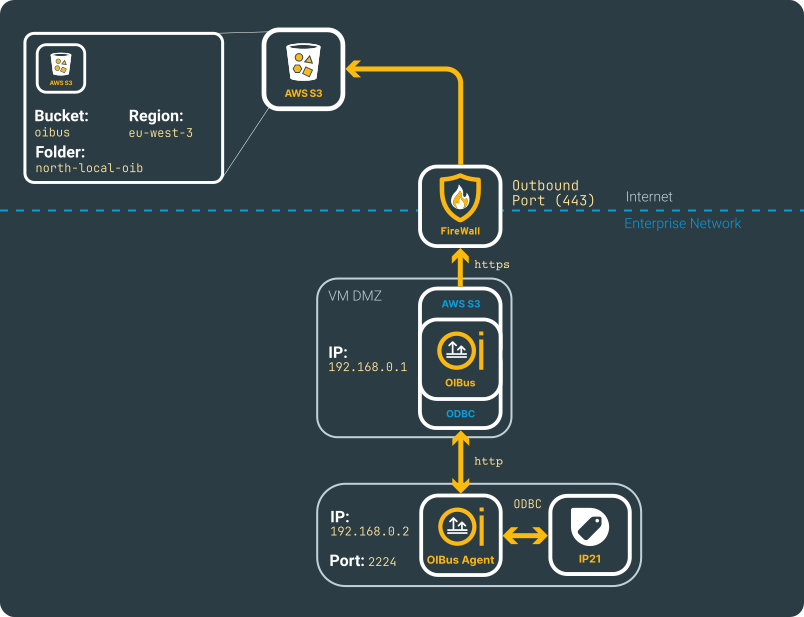
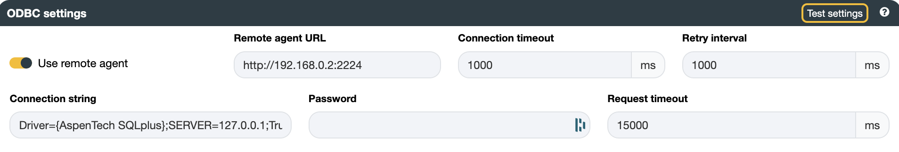
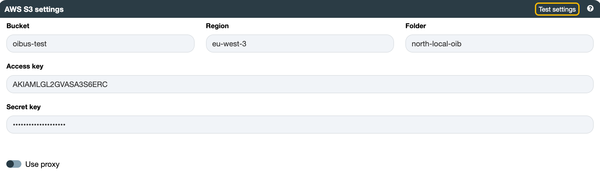

# IP21 → AWS S3
## Beforehand
AspenTech IP21 is a real-time data historian software that collects, stores, and analyzes vast amounts of time-series
data from industrial processes, offering tools for real-time monitoring, analysis, and reporting. OIBus can connect to
IP21 via ODBC.

Details regarding the configurations can be located on the [North AWS S3](../guide/north-connectors/aws-s3.md)
and [South ODBC](../guide/south-connectors/odbc) connectors pages.

This use case requires the installation of an [OIBus Agent](../guide/oibus-agent/installation) and is based on the
depicted fictional network scenario.

  

    

  

:::caution
The Aspen SQLplus driver is sensitive to network latency, so it is strongly recommended to install the OIBus Agent on
the IP21 server or at least on the same network to minimize latency between the Agent connector and the IP21 historian.

Additional network hops or firewalls between the Agent and the historian can lead to data collection issues or
performance degradation.
:::

## South ODBC
There are two options for managing ODBC connections:
- The internal [node-odbc JavaScript](https://github.com/markdirish/node-odbc) driver.
- The [OIBus Agent](../guide/oibus-agent/installation) with C# ODBC implementation.

:::info
This use case manages ODBC connections with the OIBus Agent. It is considered a best practice for IP21 connections.
:::

Ensure that the OIBus Agent is installed on the IP21 machine and that the `Use remote agent` option is checked. Based
on the previously shown network configuration, enter `http://192.169.0.2:2224` as the `Remote Agent URL`.

:::tip OIBus Agent port and network settings
When installing the OIBus Agent, port 2224 is used by default, but you can choose a different port if needed. Ensure
that the selected port is allowed for HTTP connections in your firewall settings.
:::

The connection string follows the standard ODBC format. For IP21, the `AspenTech SQLplus` ODBC driver must be installed
on the machine where the OIBus Agent is configured.

  

    

  

:::tip Testing connection
You can verify the connection by testing the settings using the `Test settings` button.
:::

### Items
The ODBC connector accepts SQL queries. You can refer to the [MSSQL item documentation](./use-case-mssql#sql-queries)
to create the items.

## North AWS S3
Be sure to have the following information before filling the appropriate fields:
- Bucket: `oibus-test`
- Region: `eu-west-3`
- Folder: `north-local-oib`
- Access key and shared key generated on AWS

  

    

  

:::tip Testing connection
You can verify the connection by testing the settings using the `Test settings` button.
:::