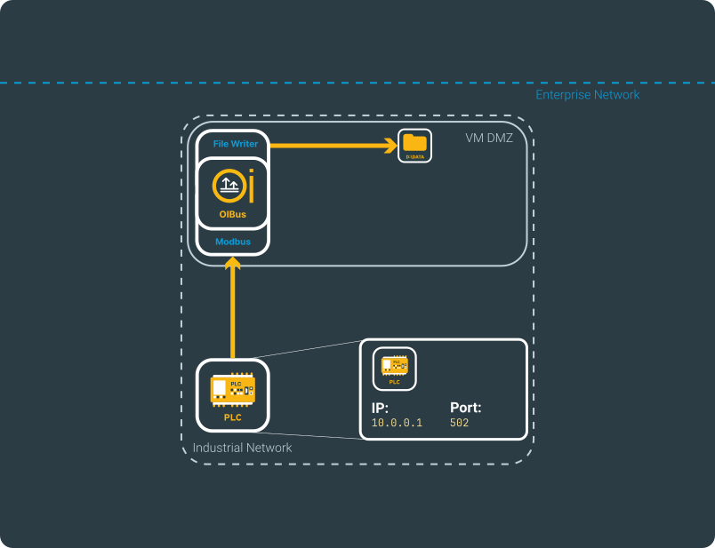
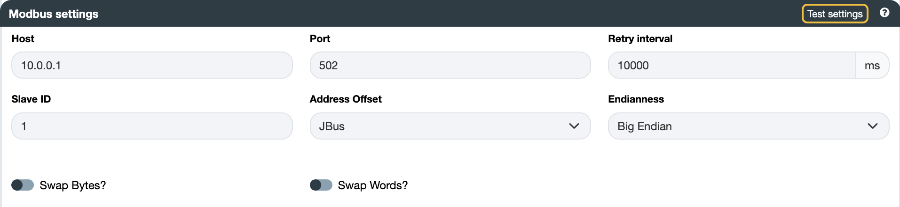
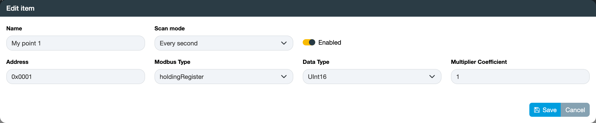
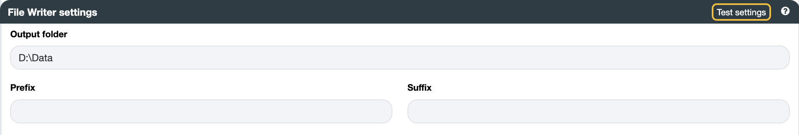

# Modbus → File Writer

## 前提条件 {#beforehand}

本使用案例是测试 OIBus 的一个很好的起点 — 您可以使用 Modbus 模拟器来尝试它，而无需真实硬件。

有关完整的配置详情，请参阅[北向 File Writer](../guide/north-connectors/file-writer.md)和[南向 Modbus](../guide/south-connectors/modbus.mdx)连接器页面。示例使用以下虚构网络。

## 南向 Modbus {#south-modbus}

您需要 Modbus 服务器的 IP 地址（或主机名）和端口（默认端口为 502）。如果服务器有多个从站，还需要目标的从站 ID — 如果只有一个从站，则使用 `1`。

在本示例中，IP 地址为 `10.0.0.1`，端口为 `502`。

根据 PLC 上寄存器地址是从 0 还是从 1 开始，选择 **JBus** 或 **Modbus** 地址偏移量。同时向 PLC 文档或其管理员确认字节序、字节交换和字交换方式。

:::tip 测试连接
点击**测试设置**以在保存前验证连接。
:::

### 项目 {#items}

添加需要读取的寄存器地址。请向 Modbus 服务器管理员咨询可用地址、其 Modbus 类型、数据类型和乘数系数。选择一个[扫描模式](../guide/engine/scan-modes.mdx)来控制采集间隔。

:::tip 批量导入
点击**导出**下载带有正确列的 CSV 模板，每行填写一个项目，然后将其导入回来。项目名称必须唯一。
:::

## 北向 File Writer {#north-file-writer}

您需要输出文件夹的路径，并且 OIBus 服务账户必须对该路径具有写入权限（例如 `D:\Data`）。

:::info Windows 上的 OIBus 系统用户
当 OIBus 作为 Windows 服务运行时，默认账户是 **SYSTEM**。如果需要访问网络共享或仅限特定用户访问的文件夹，请通过 Windows 服务管理器更改该账户。更改账户后需要重启服务。请注意，**SYSTEM** 账户默认无法访问远程（UNC）路径。
:::

OIBus 可以将数据写为原始文件或 JSON 文件。来自南向连接器的文件将按原样写入；JSON 值将被序列化为 JSON 文件。您还可以为写入输出文件夹的每个文件名添加前缀和后缀。

:::tip 测试连接
点击**测试设置**以在保存前验证连接。
:::
