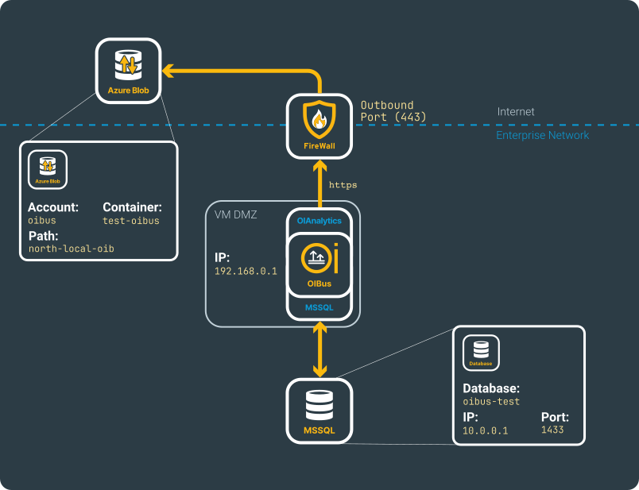
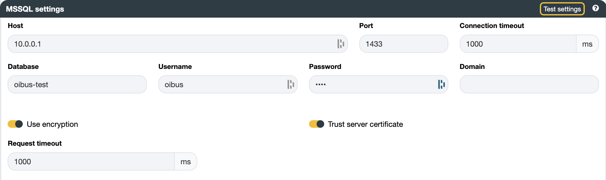
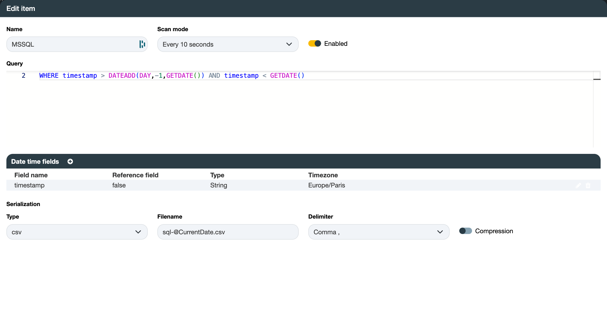
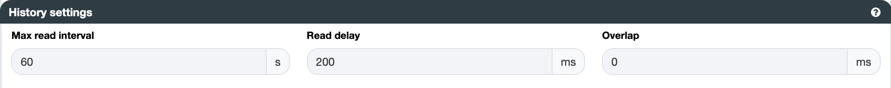
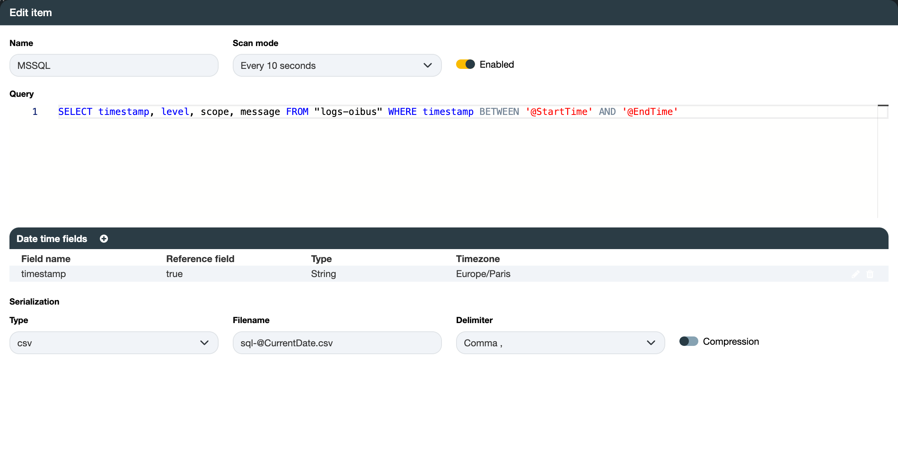
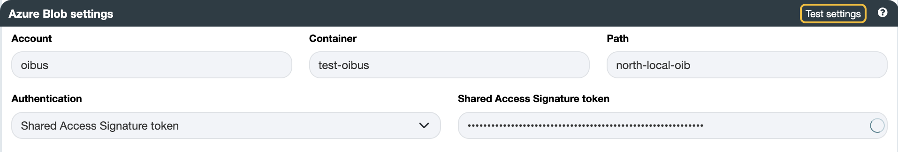

# Microsoft SQL Server™ → Azure Blob Storage™

## 前提条件 {#beforehand}

本使用案例展示了如何设置一个 SQL 连接器（此处以 MSSQL 为例），特别是如何处理带有一定调优的 SQL 查询，以及如何将
生成的 CSV 文件发送到 Azure Blob。

有关配置的详细信息，请参见[北向 Azure Blob Storage](../guide/north-connectors/azure-blob.md)和
[南向 Microsoft SQL Server™](../guide/south-connectors/mssql.mdx)连接器页面。

本示例基于下图所示的虚构网络构建。

<div style={{ textAlign: 'center' }}>



</div>

## 南向 MSSQL {#south-mssql}

请确保您已具备 MSSQL 服务器的 URL 或 IP 地址、其对应端口，以及一个只读用户。

:::caution 只读用户
虽然只读用户不是必需的，但强烈建议使用只读用户，以防止通过 SQL 查询插入或更新数据。
南向连接器的设计用途是访问数据，而不是创建新条目。
:::

按照所示模式，可以设置以下参数：

- 主机：`10.0.0.1`
- 端口：`1433`
- 数据库：`oibus-test`

<div style={{ textAlign: 'center' }}>



</div>

:::tip 测试连接
您可以使用 `Test settings` 按钮测试设置以验证连接。
:::

### SQL 查询 {#sql-queries}

OIBus 提供诸如 `@StartTime` 和 `@EndTime` 之类的查询变量。但是，使用它们并非强制要求。

#### 不使用变量 {#without-variable}

在此示例中，一个移动窗口区间可以定期检索数据而无需使用此类变量，检索范围为从现在到昨天：

```SQL
SELECT timestamp, message, level FROM table
WHERE timestamp > DATEADD(DAY,-1,GETDATE()) AND timestamp <= GETDATE()
```

:::caution DateTime 类型
请确保将日期与相同日期类型的字段进行比较，例如 DateTime 类型。使用
[cast 或 convert 函数](https://learn.microsoft.com/en-us/sql/t-sql/functions/cast-and-convert-transact-sql?view=sql-server-ver16)来
正确处理字段或比较日期。
:::

在此场景中，日期时间字段部分仍然可以用于解析日期并以适当的格式输出它们。只有
`timestamp` 是日期时间字段，我们不将其用作参考字段，因为它没有配合 `@StartTime` 或 `@EndTime` 使用。

<div style={{ textAlign: 'center' }}>



</div>

#### 使用变量 {#with-variables}

`@StartTime` 变量捕获上一次查询检索到的最大时刻。对于第一次查询，在尚未跟踪任何时刻之前，OIBus 会根据
**最大读取间隔**设置（以秒为单位）从当前时间向前回溯 — 如果最大读取间隔保持为 `0`，则回溯 1 小时。`@EndTime` 变量被设置为当前时间，
或在查询按**最大读取间隔**拆分时设置为子区间的结束时间。

为防止对服务器造成过大的查询负载，您可以将 \[`@StartTime`, `@EndTime`\] 区间划分为更小的块。这可以
在连接器设置的**历史记录设置**部分进行配置：

- **最大读取间隔**（以秒为单位）：如果设置为 60 秒，且区间为 1 小时，则将生成 60 个子区间查询。
- 每个子区间查询之间的**读取延迟**（以毫秒为单位）。
- **起始时间偏移量**（以毫秒为单位）：添加到查询窗口的起始时间（`@StartTime`）。负值会将起始时间提前，
  以便捕获延迟到达的数据 — 这是旧的“重叠”行为。
- **结束时间偏移量**（以毫秒为单位）：添加到查询窗口的结束时间（`@EndTime`）。负值会使结束时间提前；
  正值会将其延后。
- **恢复策略**：OIBus 追赶积压子区间的顺序 — `From oldest to newest`（默认，从最旧到最新）或
  `From newest to oldest`（从最新到最旧）。

<div style={{ textAlign: 'center' }}>



</div>

:::caution 何时使用起始时间偏移量？
当某些检索到的数据存在延迟，并且是在查询执行之后才被存储时，负的**起始时间偏移量**会很有帮助。
在这种情况下，它可以将请求区间稍微向后扩展，从而不会遗漏延迟到达的行。

如果您的查询涉及聚合操作，请务必谨慎，因为这可能会因移动第一个区间的时间起点而改变您的数据。
:::

```SQL
SELECT timestamp, message, level FROM logs
WHERE timestamp > @StartTime AND timestamp <= @EndTime
```

##### 日期时间字段 {#date-time-fields}

可以添加一个日期时间字段：

- 字段名称：timestamp
- 参考字段：true
- 类型：ISO 8601

`timestamp` 字段包含 ISO-8601 格式的日期时间。它作为参考字段，意味着它将被存储在南向缓存的
最大时刻中。

##### 序列化 {#serialization}

- 类型：`csv`
- 文件名：`sqlite-@CurrentDate.csv`
- 输出日期时间格式：`yyyy-MM-dd'T'HH:mm:ss.SSS'Z'`
- 输出时区：`Europe/Paris`
- 分隔符：`Comma ,`

<div style={{ textAlign: 'center' }}>



</div>

##### 结果 {#result}

请注意，带有 `@CurrentDate` 的文件名将始终以 `yyyy_MM_dd_HH_mm_ss_SSS` 格式生成。

```csv title="CSV file sqlite-2024_01_23_10_38_50_063.csv"
timestamp;message;level
2024-01-23T11:38:36.282Z;"Error while connecting to the OPCUA server. Error: The connection may have been rejected by server,Err = (premature socket termination socket timeout : timeout=60000  ClientTCP_transport57)";error
2024-01-23T11:38:36.282Z;"South connector ""OPCUA"" (keOidHvw9qJ3CXAr1_zIF) disconnected";debug
2024-01-23T11:38:36.282Z;"Error while connecting to the OPCUA server. Error: The connection may have been rejected by server,Err = (premature socket termination socket timeout : timeout=60000  ClientTCP_transport56)";error
2024-01-23T11:38:36.282Z;"South connector ""Prosys HA"" (Mv8o0vr_nyh39-eF01Q2l) disconnected";debug
2024-01-23T11:38:40.007Z;Opening ./OIBus/data-folder/logs/logs.db SQLite database;debug
2024-01-23T11:38:40.007Z;"Sending ""SELECT timestamp, message, level FROM logs WHERE timestamp > @StartTime AND timestamp < @EndTime"" with @StartTime = 2024-01-23T10:38:17.083Z @EndTime = 2024-01-23T10:38:40.006Z";info
2024-01-23T11:38:40.059Z;Found 24 results for item SQLite log 2 in 52 ms;info
2024-01-23T11:38:40.063Z;"Writing 4913 bytes into CSV file at ""./OIBus/data-folder/cache/data-stream/south-GG6BT_CR31m1h1jMpm9ud/tmp/sqlite-2024_01_23_10_38_40_063.csv""";debug
2024-01-23T11:38:40.063Z;"Sending CSV file ""./OIBus/data-folder/cache/data-stream/south-GG6BT_CR31m1h1jMpm9ud/tmp/sqlite-2024_01_23_10_38_40_063.csv"" to Engine";debug
2024-01-23T11:38:40.063Z;"Add file ""./OIBus/data-folder/cache/data-stream/south-GG6BT_CR31m1h1jMpm9ud/tmp/sqlite-2024_01_23_10_38_40_063.csv"" to cache from South ""SQLite log""";debug
2024-01-23T11:38:40.063Z;"Caching file ""./OIBus/data-folder/cache/data-stream/south-GG6BT_CR31m1h1jMpm9ud/tmp/sqlite-2024_01_23_10_38_40_063.csv"" in North connector ""Console debug""...";debug
2024-01-23T11:38:40.064Z;"File ""./OIBus/data-folder/cache/data-stream/south-GG6BT_CR31m1h1jMpm9ud/tmp/sqlite-2024_01_23_10_38_40_063.csv"" cached in ""./OIBus/data-folder/cache/data-stream/north-FSyK0CdXNxVe0onCI1RA1/files/sqlite-2024_01_23_10_38_40_063-1706006320063.csv""";debug
2024-01-23T11:38:40.066Z;Next start time updated from 2024-01-23T10:38:17.083Z to 2024-01-23T10:38:36.282Z;debug
2024-01-23T11:38:40.067Z;"File ""./OIBus/data-folder/cache/data-stream/north-FSyK0CdXNxVe0onCI1RA1/files/sqlite-2024_01_23_10_38_40_063-1706006320063.csv"" moved to archive folder ""./OIBus/data-folder/cache/data-stream/north-FSyK0CdXNxVe0onCI1RA1/archive/sqlite-2024_01_23_10_38_40_063-1706006320063.csv""";debug
2024-01-23T11:38:46.283Z;Connecting to OPCUA on opc.tcp://oibus.rd.optimistik.fr:53530/OPCUA/SimulationServer;debug
```

在此示例中，为下一次查询保存的 `@StartTime` 最大时刻将为 `2024-01-23T11:38:46.283Z`，以 ISO 8601 格式
注入到请求中。

:::tip SQLite 日志数据库
此查询示例可用于 OIBus 的 SQLite 日志数据库 `./logs/logs.db`。
:::

## 北向 Azure Blob {#north-azure-blob}

请确保拥有对具备写入权限的 Azure Blob 容器有访问权限的用户凭据。

创建 Azure Blob 北向连接器并填写相关字段：

- 账户：`oibus`
- 容器：`test-oibus`
- 路径：`north-local-oib`

如果**路径**保持为空，文件将存储在容器根目录。

<div style={{ textAlign: 'center' }}>



</div>

:::tip 测试连接
您可以使用 `Test settings` 按钮测试设置以验证连接。
:::
