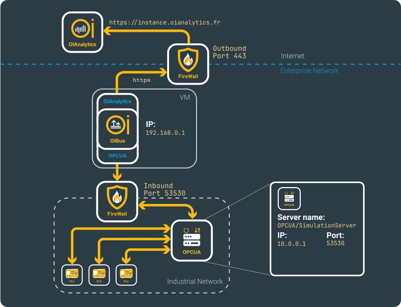
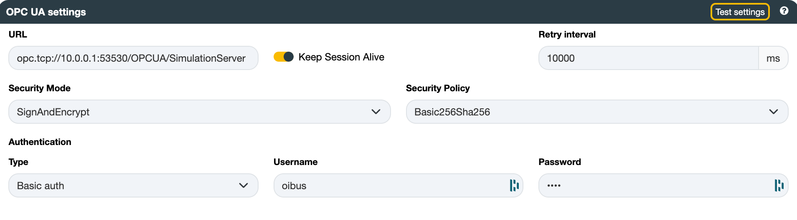
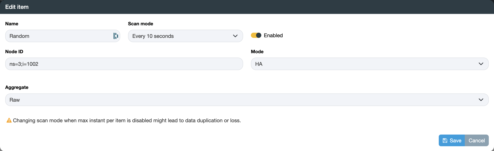

import NorthOIAnalytics from './_north_oianalytics.mdx';

# OPC UA™ → OIAnalytics®

## 前提条件 {#beforehand}

有关完整的配置详情，请参阅 [North OIAnalytics®](../guide/north-connectors/oianalytics.md) 和 [South OPC UA™](../guide/south-connectors/opcua.mdx) 连接器页面。

请确保选择 OPC UA 作为协议——它与 [OPC Classic™](../guide/south-connectors/opc.mdx) 完全不同。本示例使用以下虚构网络。

<div style={{ textAlign: 'center' }}>



</div>

## South OPC UA {#south-opc-ua}

OPC UA 服务器 URL 遵循以下结构：

```
opc.tcp://<host>:<port>/<name>
```

- `host` —— 服务器的主机名或 IP 地址（例如 `10.0.0.1`）
- `port` —— 服务器监听的端口（例如 `53530`）
- `name` —— 分配给 OPC UA 服务器的名称（例如 `OPCUA/SimulationServer`）

示例：`opc.tcp://10.0.0.1:53530/OPCUA/SimulationServer`

设置服务器要求的安全模式。如果不是 **None**，还需指定安全策略。在生产环境中应避免使用 **None**——仅在测试时使用。请向 IT 团队或 OPC UA 服务器管理员获取凭据或证书。

<div style={{ textAlign: 'center' }}>



</div>

:::tip 测试连接
点击 **Test settings** 以在保存前验证连接。
:::

### 项目 {#items}

添加需要读取的节点 ID。向 OPC UA 服务器管理员询问可用节点列表。

选择访问 **模式**（DA 或 HA）。在 HA 模式下，OIBus 会检索自上次查询以来记录的所有值，并可以对其进行聚合或重采样——请与服务器管理员确认支持哪些聚合方式。如果不确定，请使用 **Raw** 聚合方式。在 DA 模式下，OIBus 会在每次扫描时为每个项目轮询一个值——除非该项目被分配了内置的 **Subscription** 扫描模式，此时 OIBus 将改为实时接收服务器推送的值变化。

选择一个[扫描模式](../guide/engine/scan-modes.mdx)来控制采集间隔。

<div style={{ textAlign: 'center' }}>



</div>

:::tip 批量导入
点击 **Export** 下载包含正确列的 CSV 模板，每行填写一个项目，然后将其导入回来。项目名称必须唯一。
:::

<NorthOIAnalytics></NorthOIAnalytics>
