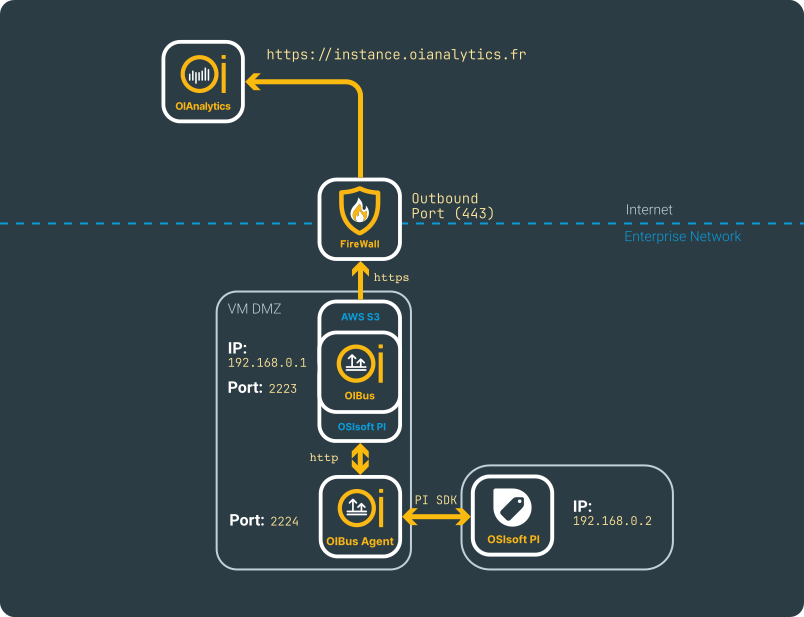
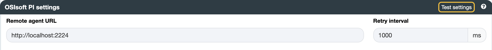
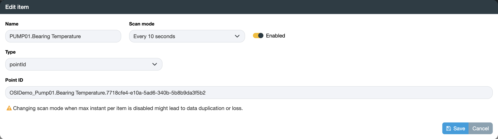
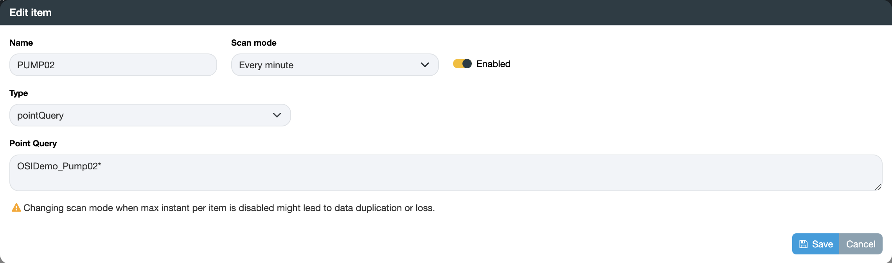

import NorthOIAnalytics from './_north_oianalytics.mdx';

# OSIsoftPI → OIAnalytics
## Beforehand
OSIsoft PI is a software suite used for real-time data management and analytics in industrial settings, providing
tools to collect, store, and analyze time-series data from various sources. It supports operational efficiency, process
optimization, and decision-making across industries like manufacturing, energy, and utilities.

Details regarding the configurations can be located on the [North OIAnalytics](../guide/north-connectors/oianalytics)
and [South OSIsoft PI](../guide/south-connectors/osisoft-pi) connectors pages.

This use case requires the installation of an [OIBus Agent](../guide/oibus-agent/installation) and is based on the
depicted fictional network scenario.

  

    

  

You can either install the OIBus Agent on the same machine as OSIsoft PI, or install it on a remote machine where the
OSIsoft PI SDK is installed. More information can be found on the [OSIsoft PI SDK settings](../guide/south-connectors/osisoft-pi#osisoft-pi-sdk-configuration).

## South PI
Enter the `Remote agent URL`. From the example, the value here is `http://localhost:2224`.

  

    

  

:::tip Testing connection
You can verify the connection by testing the settings using the `Test settings` button.
:::

### Items
OSIsoft PI items can be of two types:
- **Point ID**: Retrieve time values for a single point.
- **Query**: Retrieve time values for a list of points that match a regex-like query.

#### Point ID

  

    

  

#### Query
When using a query, the item name is used solely for logging purposes. The actual name attached to the data corresponds
to the references of the points found by the query.

  

    

  

<NorthOIAnalytics></NorthOIAnalytics>